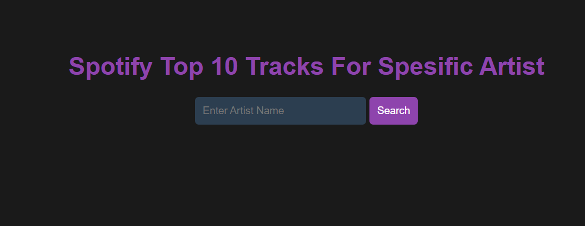
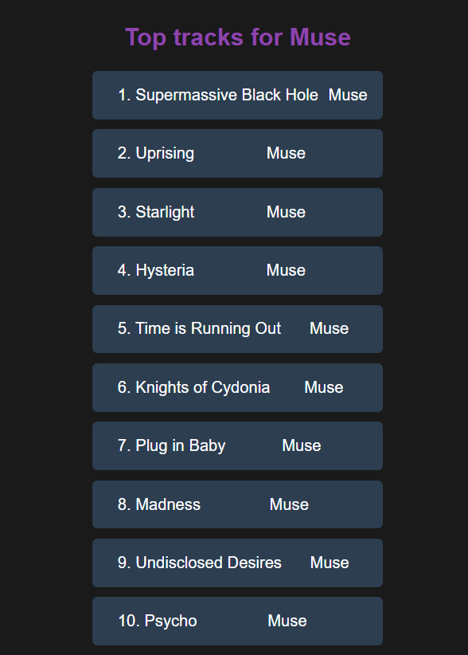

# Spotify Python Top Tracks for Spesific Artist

### Info
This project for understanding how spotify api work with python.
for using this project you have sing in spotify for developers and have to access client_id and client_secret and past them to .env

spotify for developers link 
https://developer.spotify.com/

## Usage
User choose an artist and Search top 10 songs of the artist.

